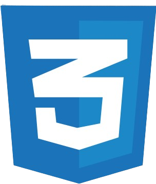
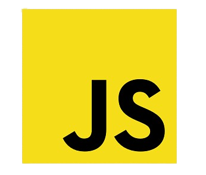
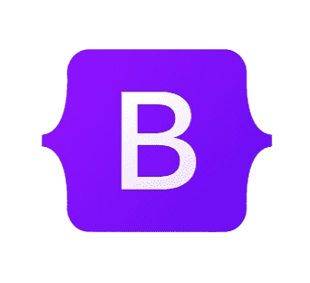
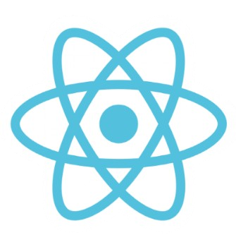
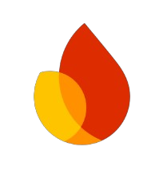

## Assalam-o-Alaikum   👋 I'm Soban Muhammad Hussain 
## A passionate frontend developer from Pakistan

**I'm a self-taught Frontend Developer with a sharp eye for clean UI and responsive designs. Currently, I'm deep-diving into the **MERN Stack** to build full-stack applications.**

- 🔭 I’m currently working on **React JS**
- 🌱 I’m currently learning **MERN STACK**
- 👯 I’m looking to collaborate on **Frontend**
- 💬 Ask me about **HTML , CSS , JAVASCRIPT , BOOTSTRAP , Fiebase & ReactJS**
- 📫 How to reach me: **hussainsubhan876@gmail.com**

### 🌐 Connect with me:

 🛠 **Languages and Tools:**

 
  
  
  
  
  
  

- 
